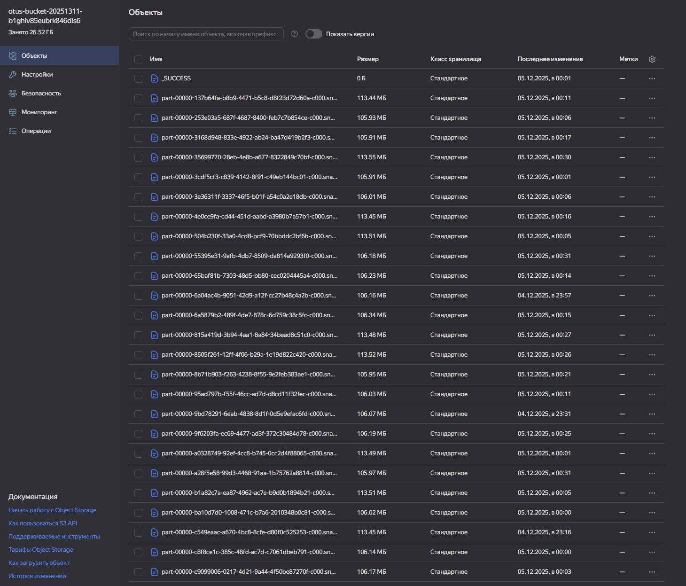

# MLOps:

Кратко
- Этот репозиторий содержит инфраструктуру, Ansible-плейбуки и ноутбук для очистки транзакционных данных.
- Поток данных: исходные CSV (HDFS) → очистка (Spark) → parquet (HDFS) → выгрузка в S3 (hadoop distcp).
- Также генерируется standalone-скрипт `clean_transactions.py` для запуска в проде/через spark-submit.

Начало работы (быстро)
1. Подготовьте окружение:
   - Terraform, Ansible, yc (Yandex CLI), jq, ssh-клиент.
2. Развертывание:
   - terraform apply -auto-approve
3. После провизионинга:
   - Найдите Jupyter URL и S3 креды в `d:\mygit\MLOps\log\terraform_summary.txt`.

Краткое описание содержимого
- infra/terraform — инфраструктура
- infra/ansible — роли/плейбуки для установки Java, Hadoop, Spark, Jupyter и нужных JAR.
- notebooks/task3.ipynb — основной ноутбук: чтение из HDFS, очистка данных, последовательная обработка файлов, запись в HDFS и выгрузка в S3.
- scripts/provision_cluster.sh — скрипт запуска Terraform → Ansible и вывода summary.

Запуск ноутбука
1. Откройте Jupyter по URL из summary.
2. В ноутбуке откройте `task3.ipynb`.
3. Выполните ячейки в порядке: инициализация → анализ/очистка → сохранение (HDFS) → выгрузка в S3.

Standalone-скрипт
- Скрипт генерируется в `/home/ubuntu/clean_transactions.py`.
- Запуск: `spark-submit /home/ubuntu/clean_transactions.py`
- Скрипт выполняет те же шаги, что и ноутбук: per-file обработка, запись в HDFS, distcp в S3.

- Получить токен S3: `terraform output -raw s3_secret_key`
- Посмотреть summary: `cat d:\mygit\MLOps\log\terraform_summary.txt`
- Проверить логи Ansible: `cat d:\mygit\MLOps/log/terraform_provision.log`
- Удаление ресурсов: `terraform destroy -auto-approve

