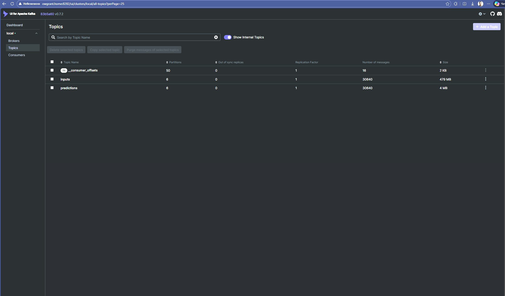
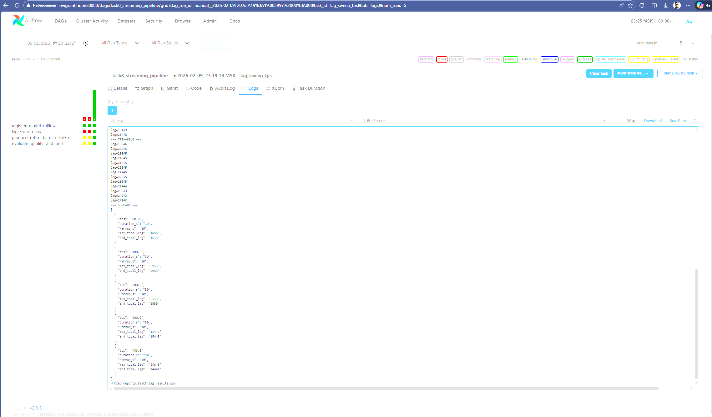
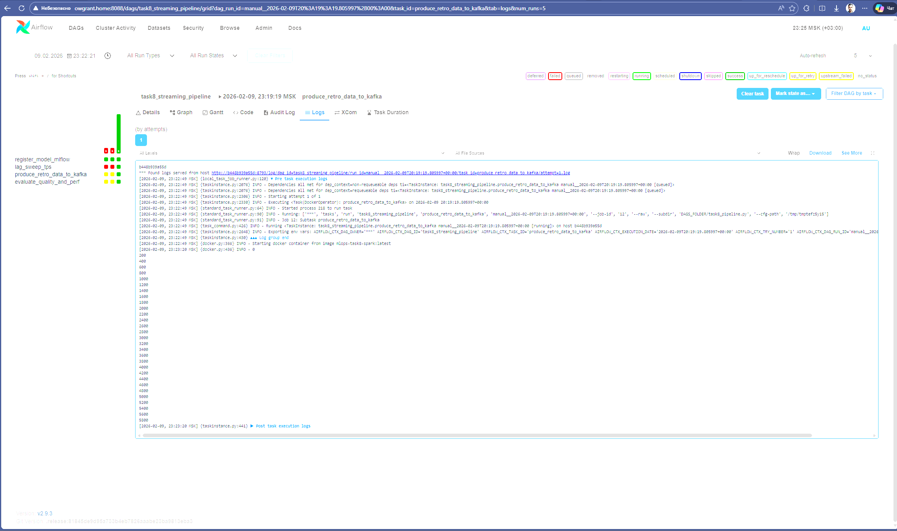
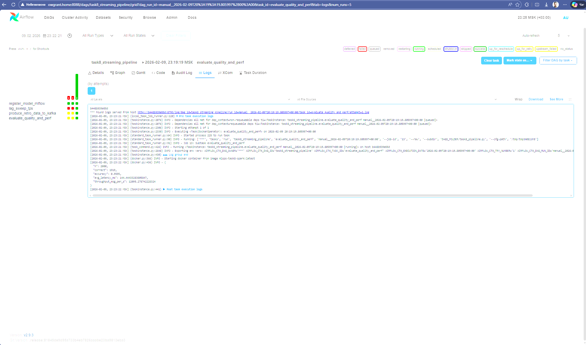

# otus_mlops_streaming

## Task 8 (docker-compose)

Локальный стек: Kafka → Spark Streaming (инференс) → Kafka + MLflow (модель/артефакты) + Airflow (оркестрация).

### Самый простой запуск

1) Поднять всё:

```bash
docker compose -f docker-compose.task8.yml up -d --build
```

2) Зарегистрировать модель в MLflow и назначить alias `champion` (делается один раз, или при обновлении модели):

```bash
docker compose -f docker-compose.task8.yml --profile init up --build mlflow-register
```

### Где смотреть

- Kafka UI: http://localhost:8282
- Spark UI: http://localhost:8080
- MLflow: http://localhost:5000
- Airflow: http://localhost:8088 (логин/пароль: airflow / airflow)





