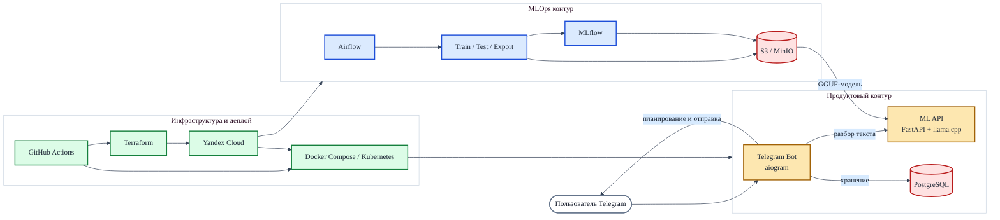
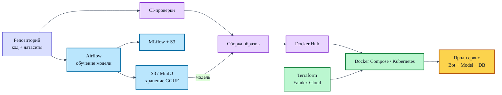

# Архитектура проекта для презентации

## 1. Общая схема

## 2. Что говорить по этой схеме

Проект состоит из трех уровней:

- Продуктовый контур: бот принимает сообщение, обращается к ML API для извлечения даты и текста, затем сохраняет напоминание в PostgreSQL.
- MLOps контур: Airflow запускает обучение, тестирование и экспорт модели в GGUF, а MLflow и S3 хранят метрики и артефакты; ML API загружает готовую модель из S3.
- Инфраструктурный контур: GitHub Actions автоматизирует тесты и деплой, Terraform и Ansible поднимают среду в Yandex Cloud, а Kubernetes или Docker Compose запускают сервисы.

## 3. Схема пайплайна обучения и доставки

## 4. Как разложить по слайдам

Слайд 1. Идея проекта

- Telegram-бот для напоминаний.
- Пользователь пишет естественным языком.
- LLM извлекает дату, время и текст напоминания.

Слайд 2. Архитектура продукта

- Показать первую схему.
- Сделать акцент на связке Bot → Model API → PostgreSQL.

Слайд 3. MLOps пайплайн

- Показать Airflow, MLflow, S3 и экспорт GGUF.
- Подчеркнуть, что модель хранится в S3 и может переобучаться и выкатываться отдельно от бота.

Слайд 4. Инфраструктура и CI/CD

- Показать вторую схему.
- Отдельно выделить Terraform, Ansible, GitHub Actions и два варианта деплоя: VM и Kubernetes.

Слайд 5. Ценность проекта

- Автоматизация напоминаний для пользователя.
- Воспроизводимый ML-пайплайн.
- Инфраструктура как код.
- Наблюдаемость и мониторинг.

## 5. Короткий текст для защиты

Этот проект объединяет продуктовую часть и MLOps-практики в одной системе. Пользователь взаимодействует с Telegram-ботом, который обращается к ML API для извлечения структуры напоминания и сохраняет результат в PostgreSQL. Сама модель проходит через MLOps-контур: Airflow запускает обучение и экспорт, MLflow хранит результаты экспериментов, а готовая GGUF-модель сохраняется в S3-совместимом хранилище, откуда ее забирает ML API. Поверх этого настроены CI/CD и инфраструктура в Yandex Cloud, поэтому систему можно воспроизводимо развернуть как через Docker Compose, так и в Kubernetes.