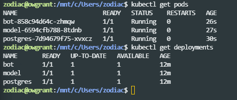
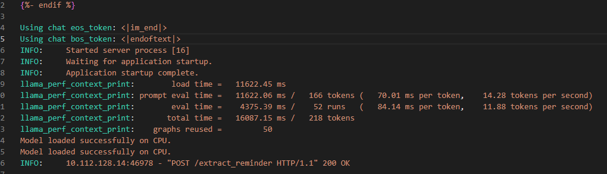
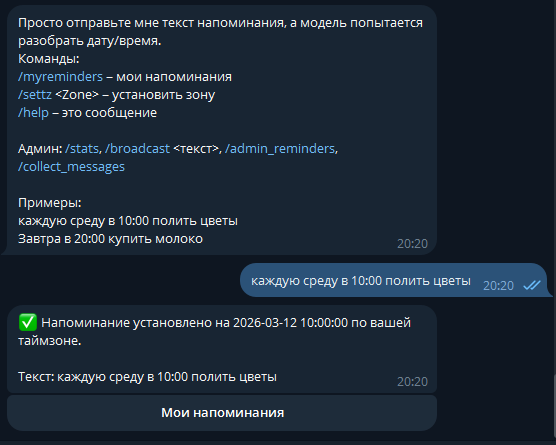
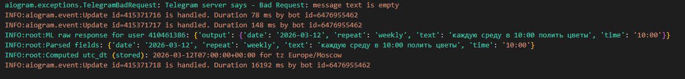

# Отчет по выполнению задания №9

В рамках работы над курсовым проектом "Telegram-бот для напоминаний" были реализованы следующие пункты задания:

## 1. REST API для модели
Для взаимодействия с моделью (Llama.cpp) разработан микросервис на базе **FastAPI**.
*   **Исходный код**: `deploy/ml-model/src/main.py`
*   **Функциональность**: API принимает текст сообщения и возвращает структурированный JSON с параметрами напоминания (текст, дата, время).
*   **Эндпоинт**: `POST /extract_reminder`

## 2. CI/CD пайплайн в GitHub Actions
Настроены workflow для автоматизации процессов разработки:
*   **Сборка образов**: Workflow `deploy-k8s.yml` собирает Docker-образы для сервисов `bot` и `model`.
*   **Публикация**: Образы автоматически пушатся в Docker Hub с тегами `latest` и номером сборки.

## 3. Kubernetes манифесты
Разработаны манифесты для развертывания сервисов в кластере (директория `k8s/`):
*   `model.yaml`: Deployment и Service для ML-модели.
*   `bot.yaml`: Deployment для Telegram-бота с передачей URL модели через переменную окружения `ML_API_URL`.
*   `postgres.yaml`: Stateful-развертывание базы данных с использованием PersistentVolumeClaim.

## 4. Создание Kubernetes кластера в Yandex Cloud
Используется Managed Service for Kubernetes. Конфигурация описана в Terraform (`infra/terraform/main.tf`):
*   Создается зональный кластер.
*   Настроена группа узлов с доступам в интернет (NAT) для загрузки образов.
*   Созданы необходимые Service Accounts и IAM-роли.

## 5. Запуск и тестирование
Сервисы успешно запущены в кластере. Бот взаимодействует с моделью внутри кластера через внутреннюю сеть Kubernetes (Service Discovery), база данных подключена и сохраняет состояние.

## 6. Автоматический деплой (Дополнительное задание)
В CI/CD пайплайн (`deploy-k8s.yml` и `deploy-k8s-only.yml`) добавлен этап `deploy-k8s`, который:
1.  Аутентифицируется в Yandex Cloud.
2.  Получает креды кластера (`yc managed-kubernetes cluster get-credentials`).
3.  Обновляет секреты из GitHub Secrets.
4.  Применяет актуальные манифесты (`kubectl apply`).
5.  Ожидает успешного старта всех подов (`kubectl rollout status`).

